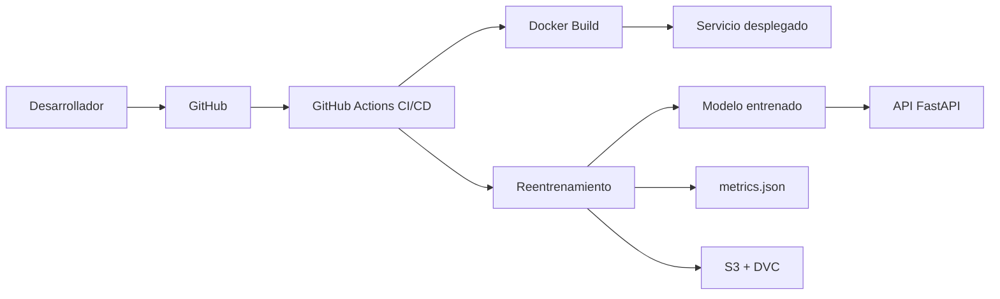

# IBM Stock Price Prediction API

Proyecto final del curso Machine Learning Operations.

Este proyecto implementa una API de predicción del precio de cierre de la acción de IBM utilizando un modelo de Machine Learning entrenado con datos históricos de precios.

## Dataset

Fuente: IBM Stock Prices 1980-2025, Kaggle.

Archivo utilizado:

```text
data/IBM_Stock_1980_2025.csv
```

## Modelo

Tipo de problema: Regresión.

Variable objetivo:

```text
Close
```

Variables predictoras:

```text
Open
High
Low
Volume
```

Modelo utilizado:

```text
RandomForestRegressor
```

## Endpoints

```text
GET /
GET /health
POST /predict
```

## Ejecutar localmente

```bash
python -m uvicorn api.main:app --reload
```

Abrir en el navegador:

```text
http://127.0.0.1:8000/docs
```

## Ejecutar con Docker

Construir imagen:

```bash
docker build -t ibm-stock-api:v1.0 .
```

Ejecutar contenedor:

```bash
docker run -d -p 8000:8000 --name ibm-stock-container ibm-stock-api:v1.0
```

Abrir en el navegador:

```text
http://127.0.0.1:8000/docs
```

Detener contenedor:

```bash
docker stop ibm-stock-container
docker rm ibm-stock-container
```

## Pruebas

```bash
pytest
```

## Métricas

Las métricas del modelo se guardan en:

```text
models/metrics.json
```

## Arquitectura



## Estado actual

- API creada con FastAPI.
- Modelo entrenado con RandomForestRegressor.
- Pruebas con Pytest.
- Dockerfile funcional.
- Métricas guardadas en JSON.